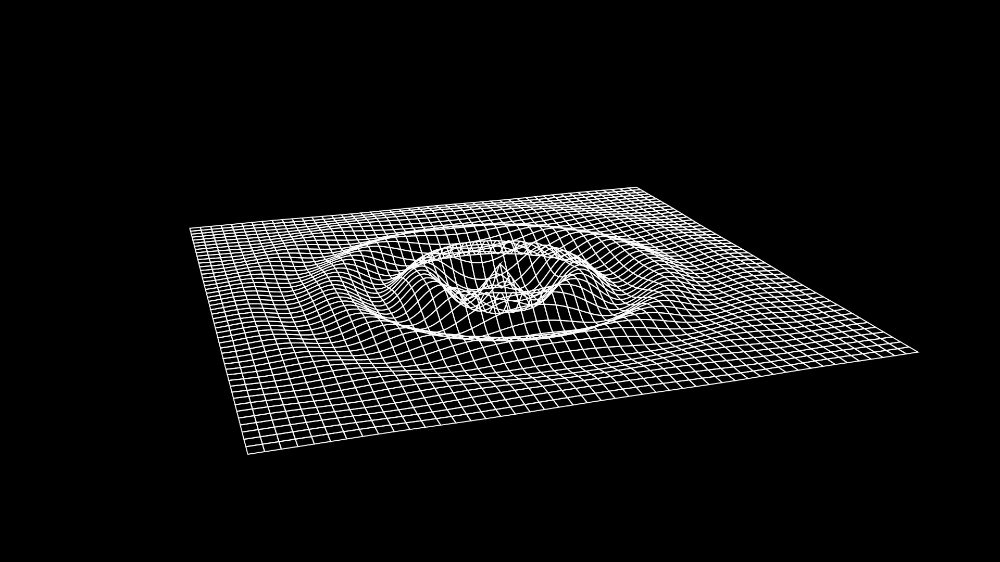

# DiffGeom Diffusion

A 3D wireframe animation visualizing heat equation diffusion with traveling wave ripples, created with Manim.

## Preview



## Mathematical Model

The surface visualizes a hybrid diffusion-wave function:

$$z(x, y, t) = A(t) \cdot \cos(k \cdot r - \omega \cdot t) \cdot e^{-\frac{r^2}{w(t)}}$$

where:
- $r = \sqrt{x^2 + y^2}$ is the radial distance
- $A(t) = \frac{1}{t^\alpha}$ — amplitude decay (energy spreading)
- $w(t) \propto t$ — Gaussian width increases (diffusion spreading)
- $\cos(kr - \omega t)$ — traveling wave with outward phase velocity

### Physical Interpretation

- **Diffusion (Heat) Aspect**: The envelope starts tall/narrow and becomes short/wide over time, mimicking the fundamental solution to the heat equation
- **Wave Aspect**: The ripples physically travel outward from the center via the phase shift $-\omega t$

## Parameters

| Parameter | Value | Effect |
|-----------|-------|--------|
| frequency | 4.0 | Controls ripple ring spacing |
| wave_speed | 3.0 | How fast ripples propagate outward |
| decay_rate | 1.0 | Rate of amplitude collapse |
| spread_rate | 2.0 | Rate of Gaussian width expansion |

## Installation

```bash
pip install -r requirements.txt
```

Requires:
- manim >= 0.17.0
- numpy >= 1.24.0

System dependencies:
- ffmpeg
- cairo

## Rendering

```bash
# Low quality (fast preview)
manim -pql src/diffusion_scene.py DiffusionPulse

# High quality
manim -pqh src/diffusion_scene.py DiffusionPulse
```

## Animation Sequence

1. **Diffusion Phase** (6s): Time evolves from t=0.2 (sharp spike) to t=4.0 (spread ripples)
2. **Rotation Phase** (2s): Ambient camera rotation to admire final state
